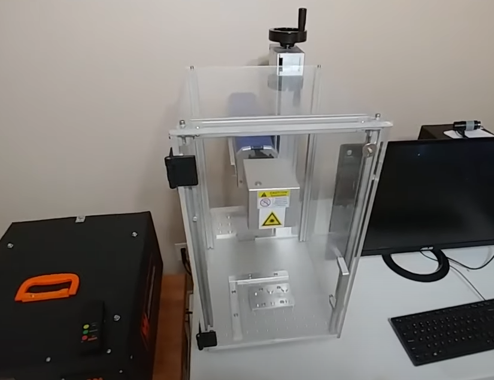
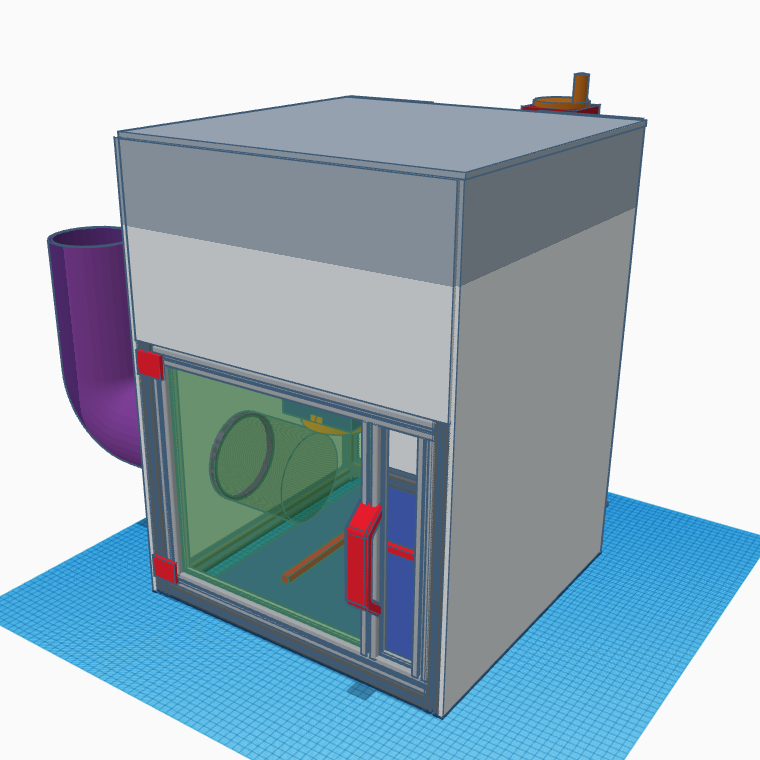
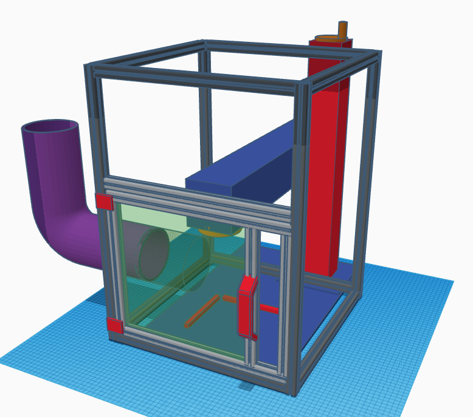

# Fiber Laser Enclosure

My workplace purchased a new fiber laser. We settled on the [Omtech FM7979-50S](https://omtechlaser.com/products/50w-fmm-5rw2-us) as the laser to purchase.  I was suprised to find that there was no enclosure or real safety considerations outside of laser safety glasses.

Since we would be using this laser in a commercial production capacity, that was a no go for us.

So after some research and planning I constructed a removable enclosure based on [JefferyJ's video](https://www.youtube.com/watch?v=igLP-VSrQdA).

I drafted up a rough design in tinkercad 

The enclosure is designed to be fairly easy to assemble and customize to different applications.  Its constructed out of 2020 alluminum extrusion.

The bill of materials is listed below.  The only thing not purchased was the "walls" which we were able to cut with our CNC at work.  If you want to cut them yourself you can find them [here]
(https://github.com/AnthonyTippy/Laser-Stuff/tree/main/Enclosure/enclosure-cut-files)

## Bill of Materials
			
 - 4 x [600mm 2020 extrusion](https://www.amazon.com/gp/product/B09KZ771SX/ref=ox_sc_act_title_6?smid=A1GSBMYGQIBJ6&psc=1)
  - 4 x [400 mm 2020 extrusion](https://www.amazon.com/dp/B09KZHFG5C/ref=twister_B0CWNZ5LT7?_encoding=UTF8&psc=1)
- [laser safety window shield](https://www.amazon.com/gp/product/B07H5L6ZKJ/ref=ox_sc_act_title_2?smid=A24ORVP5MII0UA&psc=1)
- [2020 door handle and hinges kit](https://www.amazon.com/gp/product/B07NQ5WHW9/ref=ox_sc_act_title_4?smid=A2NNEQLDWAVVRW&psc=1%27)
- [2020 extrusion corner tri bracket connector](https://www.amazon.com/gp/product/B08C9Q2TGW/ref=ox_sc_act_title_7?smid=A4HTD69KS4TBJ&psc=1)
- [2020 m5 nut and bolt kit](https://www.amazon.com/gp/product/B0C4JV8QPG/ref=ox_sc_act_title_3?smid=A1X2NHDDQ7UCAG&psc=1)
- exterior wall panels (I cut mine with the CNC we have access to )
- small 80mm exaust fan	

